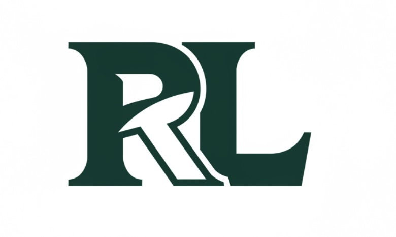

# 🌐 Rafayet's Den - Portfolio Website



A modern, responsive portfolio website showcasing my projects, skills and professional journey.

🔗 **Live Demo**: [https://rafayetm0rtaza.github.io/Rafayets_den/](https://rafayetm0rtaza.github.io/Rafayets_den/)

## 📋 Table of Contents
- [About](#about)
- [Features](#features)
- [Tech Stack](#tech-stack)
- [Project Structure](#project-structure)
- [About Me](#about-me)
- [Installation](#installation)
- [Usage](#usage)
- [Customization](#customization)
- [Contact](#contact)
- [License](#license)

## 📖 About
"Rafayet's Den" is my personal corner of the web where I showcase my portfolio as a Computer Engineering student with a passion for technology. This project serves as both a demonstration of my web development skills and a comprehensive overview of my professional experiences, education, and personal projects.

## 🚀 Features
- 💡 **Dark & Light Theme Toggle** - Seamlessly switch between dark and light modes with user preference detection
- 🎯 **Animated Sections** - Engaging AOS (Animate on Scroll) animations that enhance user experience
- 🔄 **Interactive Project Carousel** - Swiper.js-powered project showcase with navigation controls
- 📱 **Fully Responsive Design** - Optimized layout for all devices from mobile to desktop
- 📝 **Contact Form Integration** - Functional contact form powered by Formspree
- ⚡ **Smooth Navigation** - Enhanced UX with smooth scrolling and intuitive UI transitions
- 🌙 **Persistent Theme Preference** - Remembers user's theme preference using local storage

## 🛠️ Tech Stack
| Category | Technologies |
|----------|--------------|
| **Frontend** | HTML5, CSS3, JavaScript |
| **Libraries** | AOS (Animate on Scroll), Swiper.js, Font Awesome |
| **Integration** | Formspree (Contact Form) |
| **Deployment** | GitHub Pages |

## 📁 Project Structure
```
📦 Rafayets_den/
 ┣ 📂 assets/               # Images and resources
 ┃ ┣ 📂 images/             # Various images used throughout the site
 ┃ ┃ ┣ 📜 profile/          # Profile photos
 ┃ ┃ ┣ 📜 projects/         # Project screenshots
 ┃ ┃ ┗ 📜 logos/            # Logos and icons
 ┃ ┗ 📜 resume.pdf          # Downloadable resume
 ┣ 📜 index.html            # Main HTML document
 ┗ 📜 README.md             # Project documentation
```

## 👨‍💻 About Me
I'm Rafayet Murtaza, a Computer Engineering student at Michigan State University with a passion for embedded systems, automation, and data analytics. My technical journey spans from Python automation scripts to hardware-software integrations.

### Education
- **Michigan State University** - Bachelor of Science in Computer Engineering
  - Expected Graduation: August 2027
  - GPA: 3.6/4.0

### Technical Skills
- Circuit Design
- Arduino & Microcontrollers
- MATLAB
- C/C++
- Python
- CAD
- FPGA

### Achievements
- Duke of Edinburgh's Award (Bronze & Silver)
- Mathematics Regional Olympiad

## 🔧 Installation
To run this portfolio locally:

1. Clone the repository:
   ```bash
   git clone https://github.com/rafayetm0rtaza/Rafayets_den.git
   ```
2. Navigate to the project directory:
   ```bash
   cd Rafayets_den
   ```
3. Open `index.html` in your preferred browser.

## 💻 Usage
Feel free to use this portfolio as a template for your own personal website:

1. Replace the content in `index.html` with your own information
2. Update images in the `assets` folder with your own
3. Modify the styles to match your personal branding
4. Update the Formspree endpoint in the contact form

## 🎨 Customization
This portfolio can be easily customized:

### Changing Colors
Modify the CSS variables in the `:root` and `[data-theme="dark"]` selectors to change the color scheme:

```css
:root {
    --primary-color: #4DA674;
    --text-color: #023336;
    --bg-color: #EAF8E7;
    --card-bg: #C1E6BA;
    /* Add your custom colors here */
}
```

### Adding New Projects
Add new projects to the Swiper carousel by duplicating the project card structure:

```html
<div class="swiper-slide">
  <div class="project-card">
    <!-- Project content here -->
  </div>
</div>
```

## 📬 Contact
- Email: murtaza2@msu.edu
- LinkedIn: [Sardar Rafayet Bin Murtaza](https://www.linkedin.com/in/sardar-rafayet-bin-murtaza-b6a9b31b3/)
- GitHub: [rafayetm0rtaza](https://github.com/rafayetm0rtaza)

## 📄 License
This project is licensed under the MIT License - see the LICENSE file for details.

---
© 2025 Sardar Rafayet Bin Murtaza. All rights reserved.